# Welcome!

## About this talk:

There are lots of tutorials on making an object detector work with a pre-trained
dataset, but not many on how to make your own datasets for object detection.

Over coming Synthetic data

Wildlife detection and monitoring with a limited dataset that anyone with a camera or smart phone can create

I hope that no matter your experience you'll learn something new today!

## About me:
👋 Hello,  I'm [Sage Elliott](https://www.linkedin.com/in/sageelliott/).

I'm a technical evangelist at [Galvanize](https://www.galvanize.com/) with experience creating computer vision systems for manufacturing quality assurance, architecture design generation, and wildlife monitoring. I love helping people learn new things.

I'm really excited to have you here for this this talk!
Originally I was going to give this talk in person at a python meetup in
Seattle. Then 2020 happened... Hopefully doing this virtually will reach outside
of seattle! 

Where are you watching this from right now? 

**Thank you all for coming tonight!**


## Sponsorship & Give away

I was thinking of ways to bring in sponsors to virtual events. 

[hyperlabel](https://hyperlabel.com/) is the image labeling tool I used in this 
project and they agreed to be a sponsor!

Hyperlabel will be giving 4 winners $25 each for door dash to help support 
your favorite local restaurants. 

Enter to win here: [link]()

Thank you [hyperlabel](https://hyperlabel.com/)!!!

[](https://hyperlabel.com/)

--------------

# Data

The not always most fun, but maybe the most important. 

In this case I actually had a lot of fun!


## Collecting the data:

I used my smart phone.

Often you're going to reduce the resolution during your model training process, 
so super high resolution doesn't matter too much.

When collecting think of what you want to capture:

- Object angles
    - Side
    - top
    - back
    - front

- Object positions
    - sitting
    - swimming
    - eating
    - flying

- Object variations
    - age
    - color
    - type  

This example I am creating a dataset of canadian geese. Fortunately for me.
They don't have much variation in appearance.

but I still need to take in account the first two 

In total I only took 87 photos. Many were very similar.

> Example pictures:


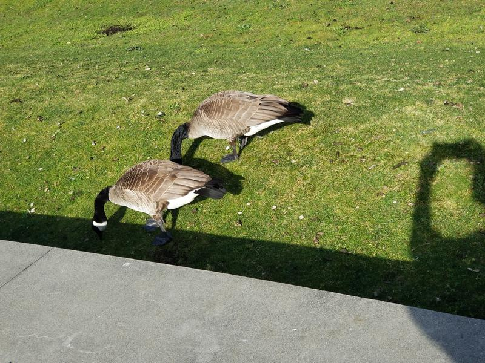

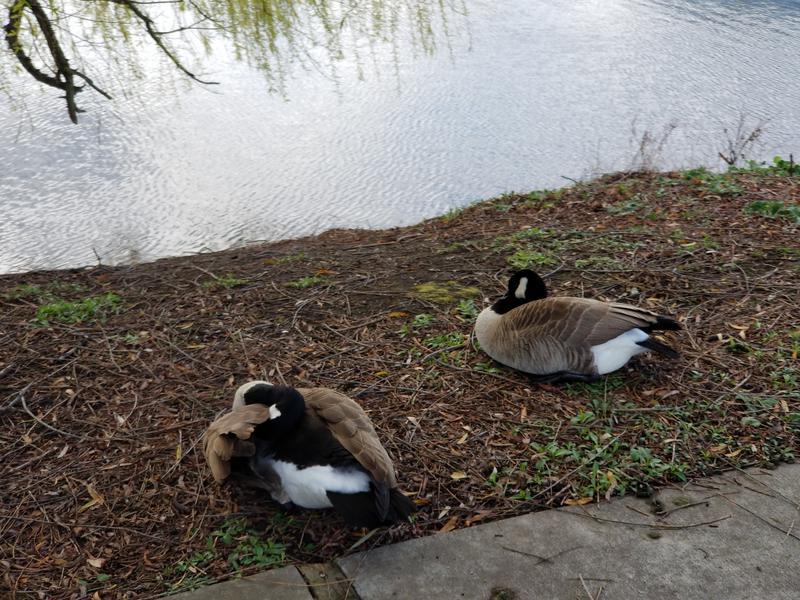


> Not part of the data set, but the geese recently had babies!


## Overcome a limited dataset


### Synthetic data 

What is sythetic data

Types of synthetic

Example use cases of synthtic datasets


Different backgrounds, rotation, positions, object variations(cow example)

I think this idea is one of the coolest things, it's gaining traction
but I'm still surprised that it's not talked about more!

This example I made my synthetic dataset manually, but you're probably already
asking how can I automate it?

### Creating our own sythetic data set

we're going to come back to creating more extreme synthetic data
after our initial training. 


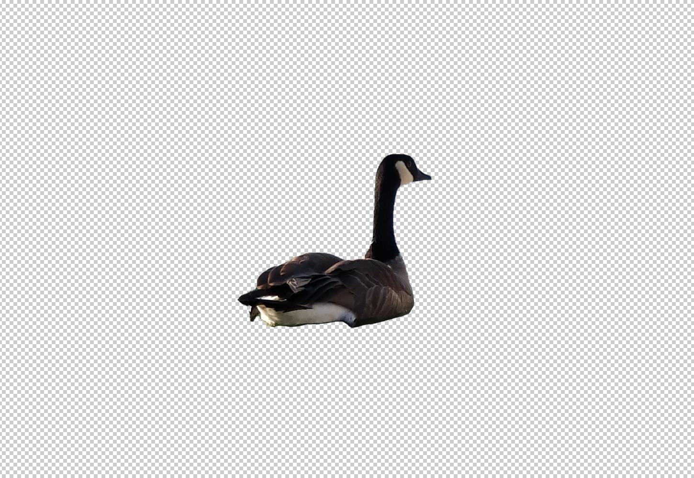


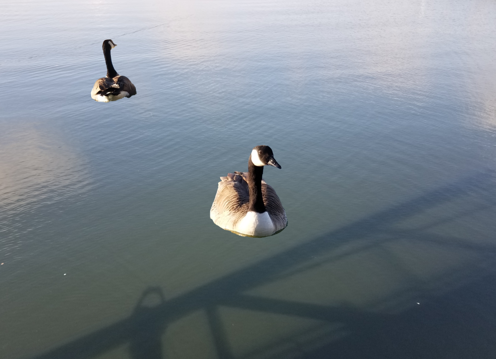
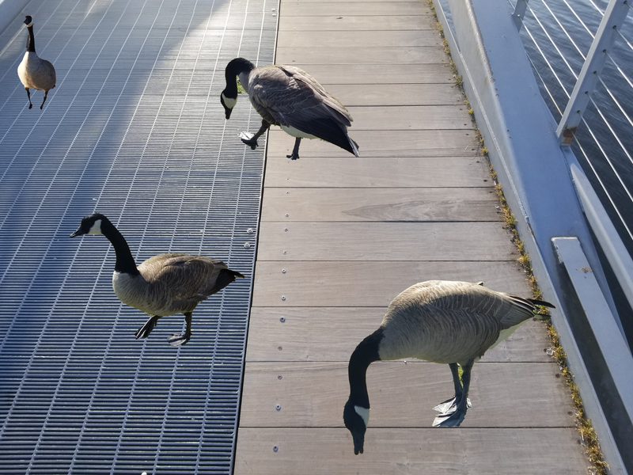


### data augmentation

You may already be familiar with a more widely used concept of data augmentation

What data augmentation is:

What it isn't:


## Resizing the dataset:

Even though you usually resize in during loading your dataset for training
it can help speed things up resizing your images before loading into memory. 

Resize script:

```python
from PIL import Image
import os
import argparse

def rescale_images(directory, size):
    for img in os.listdir(directory):
        im = Image.open(directory+img)
        im_resized = im.resize(size, Image.ANTIALIAS)
        im_resized.save(directory+img)

if __name__ == '__main__':
    parser = argparse.ArgumentParser(description="Rescale images")
    parser.add_argument('-d', '--directory', type=str, required=True, help='Directory containing the images')
    parser.add_argument('-s', '--size', type=int, nargs=2, required=True, metavar=('width', 'height'), help='Image size')
    args = parser.parse_args()
    rescale_images(args.directory, args.size)
```


## Labeling the data 

Different type of labels. 

- Image segementation
- Object detection
- Classification

Some other label options you may see in computer vision
- Keypoint
- context


Our case we want to do object detection. The boxes around the objects.

There are a couple good labeling options

- hyperlabel
- imagelabeler

I chose hyper label. Again shout out for them sponsoring tonight!

Enter give away here [link]()

keep in mind that every labeler may have slightly different annotation generation


What labeling looks like

ADD IMAGES OF USING HYPER LABEL & MAKE SCHEMA


Export:
You get different export options

For me I'm using VOC pascal which exports the images and XML annotations of
boudning boxes

Understanding the annotations

XML Example:

```xml
<annotation>
  <folder>GeneratedData_Train</folder>
  <filename>3.png</filename>
  <source>
    <database>3</database>
  </source>
  <size>
    <width>800</width>
    <height>600</height>
    <depth>Unknown</depth>
  </size>
  <segmented>0</segmented>
  <object>
    <name>goose</name>
    <pose>Unknown</pose>
    <truncated>0</truncated>
    <difficult>0</difficult>
    <occluded>0</occluded>
    <bndbox>
      <xmin>159.28430879566355</xmin>
      <xmax>342.9821219169359</xmax>
      <ymin>219.6319686872721</ymin>
      <ymax>405.6469286512451</ymax>
    </bndbox>
  </object>
  <object>
    <name>goose</name>
    <pose>Unknown</pose>
    <truncated>0</truncated>
    <difficult>0</difficult>
    <occluded>0</occluded>
    <bndbox>
      <xmin>537.1769383697813</xmin>
      <xmax>660.7554380746769</xmax>
      <ymin>55.55722749247779</ymin>
      <ymax>179.5672008017932</ymax>
    </bndbox>
  </object>
  <object>
    <name>goose</name>
    <pose>Unknown</pose>
    <truncated>0</truncated>
    <difficult>0</difficult>
    <occluded>0</occluded>
    <bndbox>
      <xmin>84.85088007113569</xmin>
      <xmax>139.24456192532307</xmax>
      <ymin>4.522350222409504</ymin>
      <ymax>82.74403297229314</ymax>
    </bndbox>
  </object>
</annotation>
```

Converting to a CSV file.

You could skip the step of generating a CSV file and directly create a TF Record
but I've found having a CSV file helpful in the past.

- A chance to pause and check your data
- If your labeling tool doesn't save a project, you can append new annotation
to your CSV file.


```python
def xml_to_csv(path):
    xml_list = []
    for xml_file in glob.glob(path + '/*.xml'):
        tree = ET.parse(xml_file)
        root = tree.getroot()
        for member in root.findall('object'):
            value = (root.find('filename').text,
                     int(root.find('size')[0].text),
                     int(root.find('size')[1].text),
                     member[0].text,
                     int(round(float(member[5][0].text))),
                     int(round(float(member[5][1].text))),
                     int(round(float(member[5][2].text))),
                     int(round(float(member[5][3].text)))
                     )
            xml_list.append(value)
    column_name = ['filename', 'width', 'height', 'class', 'xmin', 'xmax', 'ymin', 'ymax']
    xml_df = pd.DataFrame(xml_list, columns=column_name)
    return xml_df
def main():
    for folder in ['train', 'test']:
        image_path = os.path.join(os.getcwd(), ('images/' + folder))
        xml_df = xml_to_csv(image_path)
        xml_df.to_csv(('images/'+folder+'_labels.csv'), index=None)
    print('Successfully converted xml to csv.')
main()

```


#### OpenCV annotation check

Always check your annotations! I really wish someone had drilled this into me
early. checking you read in your annotations correctly can save you a lot of
time debugging.

Use openCV to read the annotations

```python
# %%
import cv2
import pandas as pd
from PIL import Image

# %%
full_labels = pd.read_csv('train_labels.csv')

# %%
full_labels.head(10)

# %%
def draw_boxes(image_name):
    selected_value = full_labels[full_labels.filename == image_name]
    img = cv2.imread('train/{}'.format(image_name))
    for index, row in selected_value.iterrows():
        img = cv2.rectangle(img, (row['xmin'], row['ymin']), (row['xmax'], row['ymax']), (0, 255, 0), 3)
    return img

# %%
Image.fromarray(draw_boxes('20200320_180628.jpg'))

# %%
Image.fromarray(draw_boxes('20200320_180651.jpg'))
```


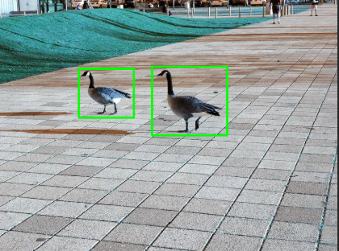


I'm guilty of not checking and wasting hours debugging. because I was "sure"
I was reading them correctly.

--------------

# Training 

## Model Selection

Different types of computer vision applications require different models

#### Common Models for Object Detection

- SSD
- Yolo
- Mask R-CNN

#### Transfer learning

CNNs basics
Weights
Imagenet dataset
Coco dataset

Minimum 200 images rule of thumb for transfer learning

May need thousands without transfer learning. Keep in mind that synthetic data 
may be a way to turn hundreds into thousands. Depends on you data and what
you're doing with it. 

#### Implementations

There are quite a few implementations for different model types. 

I chose to use ones included in tensorflows offcial repo. I feel like it's
maybe the most approachable for most people

Note that most of the models are under the research directory. These are not
always offcially maintained. 

There is a great resource to get started with the included tensflow model here:

Setup tips Quick summary of setting up:

TF & Python versions

More resources included at the end.

Create TF record with our CSV file containing images and annotations:

```python

"""
Usage:
  # From tensorflow/models/
  # Create train data:
  python generate_tfrecord.py --csv_input=data/train_labels.csv  --output_path=train.record
  # Create test data:
  python generate_tfrecord.py --csv_input=data/test_labels.csv  --output_path=test.record
"""
from __future__ import division
from __future__ import print_function
from __future__ import absolute_import

import os
import io
import pandas as pd
import tensorflow as tf

from PIL import Image
from object_detection.utils import dataset_util
from collections import namedtuple, OrderedDict

flags = tf.app.flags
flags.DEFINE_string('csv_input', '', 'Path to the CSV input')
flags.DEFINE_string('output_path', '', 'Path to output TFRecord')
flags.DEFINE_string('image_dir', '', 'Path to images')
FLAGS = flags.FLAGS


# TO-DO replace this with label map
def class_text_to_int(row_label):
    if row_label == 'goose':
        return 1
    else:
        None


def split(df, group):
    data = namedtuple('data', ['filename', 'object'])
    gb = df.groupby(group)
    return [data(filename, gb.get_group(x)) for filename, x in zip(gb.groups.keys(), gb.groups)]


def create_tf_example(group, path):
    with tf.gfile.GFile(os.path.join(path, '{}'.format(group.filename)), 'rb') as fid:
        encoded_jpg = fid.read()
    encoded_jpg_io = io.BytesIO(encoded_jpg)
    image = Image.open(encoded_jpg_io)
    width, height = image.size

    filename = group.filename.encode('utf8')
    image_format = b'jpg'
    xmins = []
    xmaxs = []
    ymins = []
    ymaxs = []
    classes_text = []
    classes = []

    for index, row in group.object.iterrows():
        xmins.append(row['xmin'] / width)
        xmaxs.append(row['xmax'] / width)
        ymins.append(row['ymin'] / height)
        ymaxs.append(row['ymax'] / height)
        classes_text.append(row['class'].encode('utf8'))
        classes.append(class_text_to_int(row['class']))

    tf_example = tf.train.Example(features=tf.train.Features(feature={
        'image/height': dataset_util.int64_feature(height),
        'image/width': dataset_util.int64_feature(width),
        'image/filename': dataset_util.bytes_feature(filename),
        'image/source_id': dataset_util.bytes_feature(filename),
        'image/encoded': dataset_util.bytes_feature(encoded_jpg),
        'image/format': dataset_util.bytes_feature(image_format),
        'image/object/bbox/xmin': dataset_util.float_list_feature(xmins),
        'image/object/bbox/xmax': dataset_util.float_list_feature(xmaxs),
        'image/object/bbox/ymin': dataset_util.float_list_feature(ymins),
        'image/object/bbox/ymax': dataset_util.float_list_feature(ymaxs),
        'image/object/class/text': dataset_util.bytes_list_feature(classes_text),
        'image/object/class/label': dataset_util.int64_list_feature(classes),
    }))
    return tf_example


def main(_):
    writer = tf.python_io.TFRecordWriter(FLAGS.output_path)
    path = os.path.join(FLAGS.image_dir)
    examples = pd.read_csv(FLAGS.csv_input)
    grouped = split(examples, 'filename')
    for group in grouped:
        tf_example = create_tf_example(group, path)
        writer.write(tf_example.SerializeToString())

    writer.close()
    output_path = os.path.join(os.getcwd(), FLAGS.output_path)
    print('Successfully created the TFRecords: {}'.format(output_path))


if __name__ == '__main__':
    tf.app.run()

```

## Training the model

changes to work with different annotations

I started with default settings

But you can change them here:

--------------

# Results

our initial results

Add Examples of just geese

Make video GIF of geese classification


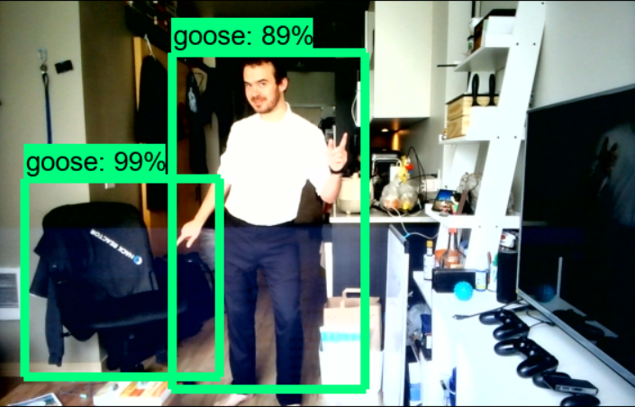

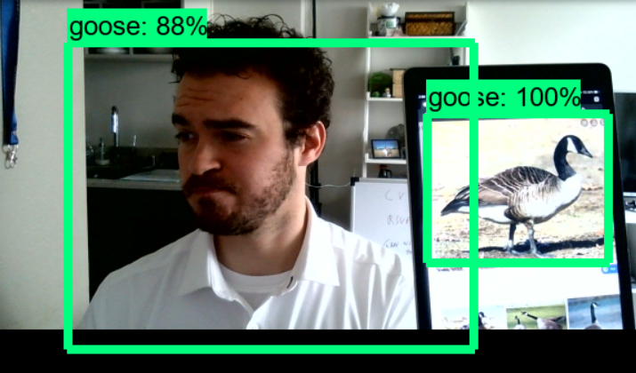

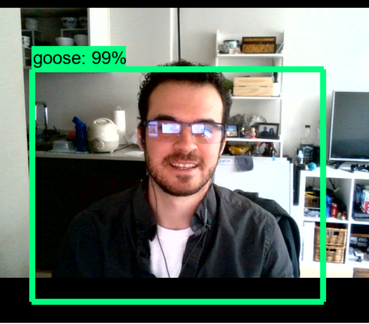


Let's say now our goal is to detect geese in my apartment

I'm a goose!

transfer learning we didn't do a good enough job of telling it what WASN't a
goose


## Retrainig with synthtic dataset of living room

Even with out small dataset we did a pretty good job of telling our model
what a goose IS.

But we didn't do a good job of telling it what a goose ISN"T.

We want to add in some noise to the data, like objects and people so as the
model is training it can learn when it makes a mistake on them.


## Create data set with living room:


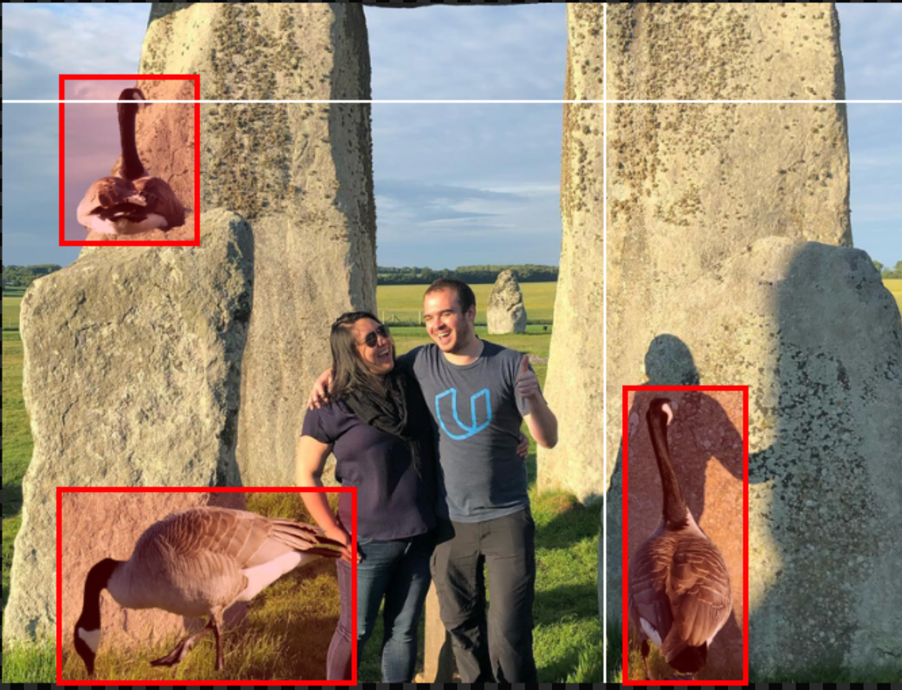


> Image from unsplash


In total I added 10 new images with my living room or people in the background

Lets re-train our model and see the results

## Results:


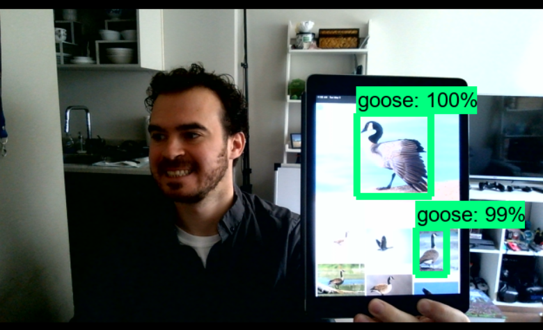


It's not perfect

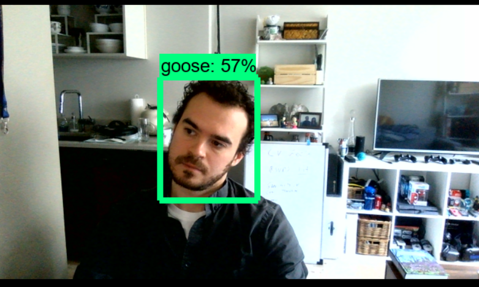

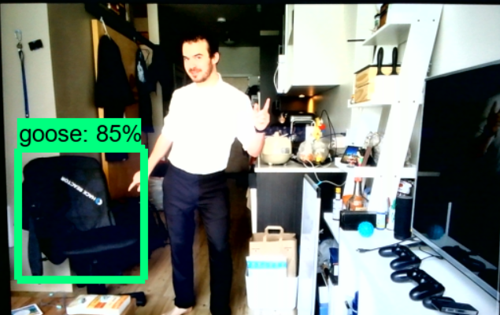

We could fix by adjusting the confidence 


## Future improvements:

more data

more synthetic data. chairs


--------------

# Wrap up

## Summary

I hope this inspired you to make your own object detector or get started with computer vision!

And how powerful sythetic data sets have the potential to be!

## Stay connected:

Please feel free to reach out to me with any questions. 
I love helping other learn.

this github repo: [goose.sage.codes](https://github.com/sagecodes/make-a-wildlife-object-detector)
linkedin: [Sage Elliott](https://www.linkedin.com/in/sageelliott/)
twitter: [@sagecodes](https://twitter.com/sagecodes)
site: [sageelliott.com](https://sageelliott.com/)


## Hyper Label Give away

Again, thank you to hyper label fo sponsoring

## Useful Resources:

- [Hyper Label: Image labeling](https://hyperlabel.com/) used for labeling the images

- [Tensorflow object detection setup guide](https://gilberttanner.com/blog/creating-your-own-objectdetector)

- [Another good tensorflow object tutorial](https://www.youtube.com/watch?v=Rgpfk6eYxJA&t=1024s)

- [Make synthetic datsets with python](https://www.immersivelimit.com/tutorials/composing-images-with-python-for-synthetic-datasets)

- [Racoon detection blog post](https://github.com/datitran/raccoon_dataset)

Scripts I used: