# Welcome!

## About this talk:

There are a lot of tutorials on making an object detector work with a pre-trained
dataset, but not many on how to make your own datasets for object detection.

We're going to talk about:

- Collecting Data
- Labeling your own data for object detection models
- Overcoming several challenges by using Sythetic data sets.
- Choosing a model


## About me:
👋 Hello,  I'm [Sage Elliott](https://www.linkedin.com/in/sageelliott/).

I'm a technical evangelist at [Galvanize](https://www.galvanize.com/)!

For the past decade I've worked as a software and hardware engineer with 
Startups and Agencies in Seattle, WA and Melbourne, FL.
I love making things with technology!

In the past couple years I got into computer vision by using it to solve 
a complicated manufacturing quality assurance problem. 

Since then I've worked on some really cool projects around architecture design generation, and wildlife monitoring.

I'm really excited to have you here for this this talk!
Originally I was going to give this talk in person at a python meetup in
Seattle. Then 2020 happened... Hopefully doing this virtually will reach outside
of seattle! 

Where are you watching this from right now? 

**Thank you all for coming tonight!**


## Co-hosting & Sponsorship 

[HyperLabel](https://hyperlabel.com/) is the image labeling tool I used in this 
project and they agreed to be a sponsor!

With me here today is Alex Robb from the HyperLabel team. 
Alex will be hanging around after the talk if anyone has any questions for him.
When he's not working Alex loves Skiing and Mountain Biking in the PNW.

HyperLabel will be giving 4 winners $75 each for doordash to help support 
your favorite local restaurants. 

Enter to win here: [https://bit.ly/givinggoose](https://docs.google.com/forms/d/e/1FAIpQLSeyXxjmNCJm0OvjtXMpeADhS0GFanKHPGba0LdWb8JULZq3qQ/viewform?usp=sf_link)

Thank you Alex & [HyperLabel](https://hyperlabel.com/) Team!!!

[](https://hyperlabel.com/)

--------------

# Data

The not always most fun, but maybe the most important. 

In this case I actually had a lot of fun!


## Collecting the data:

For this project I wanted to collect data in a way that most people could.

I just used my smart phone.

Often you're going to reduce the resolution during your model training process, 
so taking photos at super high resolution often won't matter.

When collecting think of what you want to capture:

- Object angles
    - Side
    - top
    - back
    - front

- Object positions
    - sitting
    - swimming
    - eating
    - flying

- Object variations
    - age
    - color
    - type

- Object environment
    - backgrounds
    - lighting
    - weather


If you have an idea for a project, I want you to think of some variations you
might need to capture.

This example I am creating a dataset of canadian geese. Fortunately for me.
They don't have much variation in appearance.

but I still need to take in account the first two 

In total I only took 87 photos. Many were very similar.

I live near a park with plenty of geese so finding some was easy.

> Example pictures:
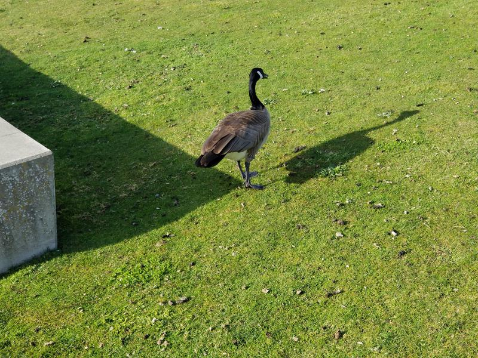
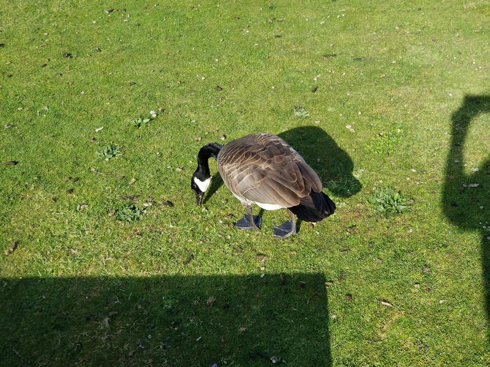

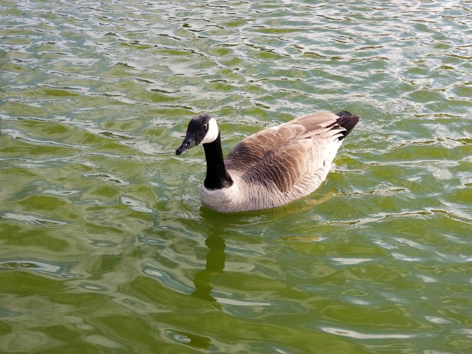


> Not part of the data set, but the geese recently had babies!
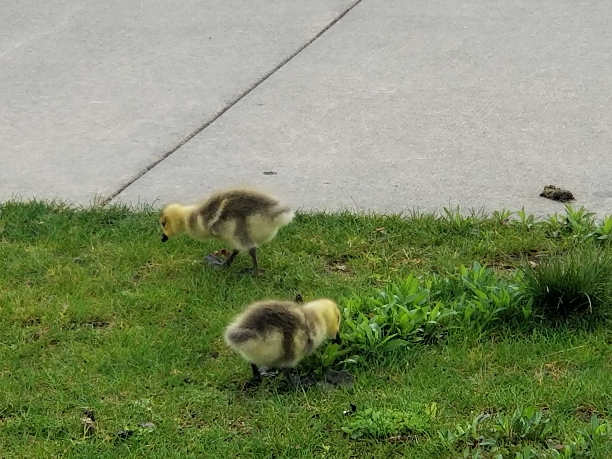
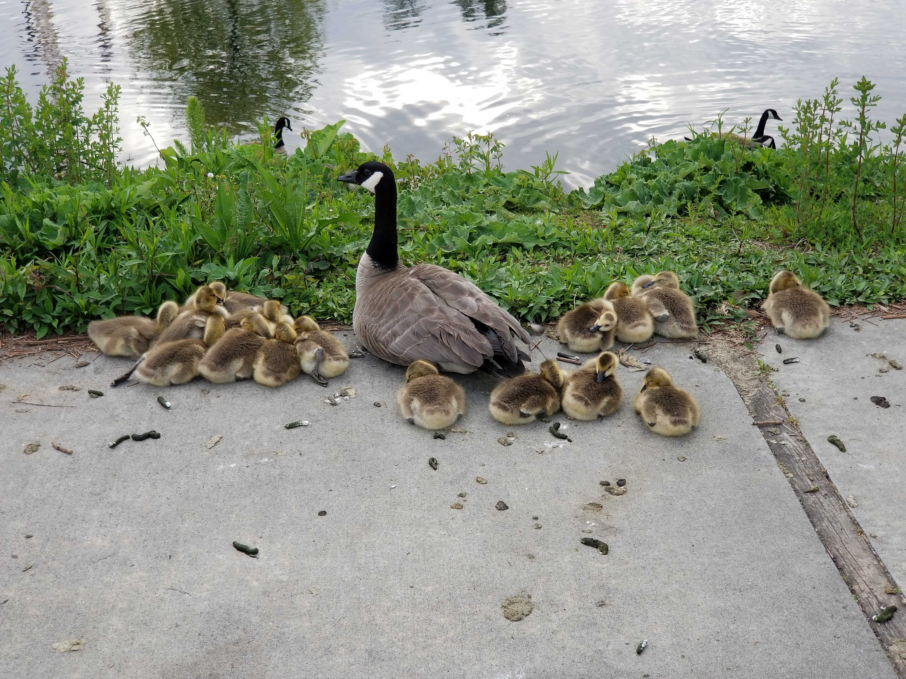


## Overcome a limited dataset


### Synthetic data 

Synthetic data sets allows us to train on data that we anticipate but we were
not able to capture.

The types I'm excited about:

- Images (Like we're going to make)
- virtual cities / environments in a 3d space. Like unity for self driving cars. 


Again if you have a project in mind, think about any variations that may be hard
for you to capture yourself.


Example use cases of synthtic datasets

Different

backgrounds, rotation, positions, object variations(cow example)


I think this idea is one of the coolest things, it's gaining traction
but I'm still surprised that it's not talked about more!


### Creating our own sythetic data set

We're going to come back to creating more extreme synthetic data
after our initial training to solve a new challenge which will show us how powerful
it can be. 


> Single Goose Example


> Background example:


> Sythetic Examples:
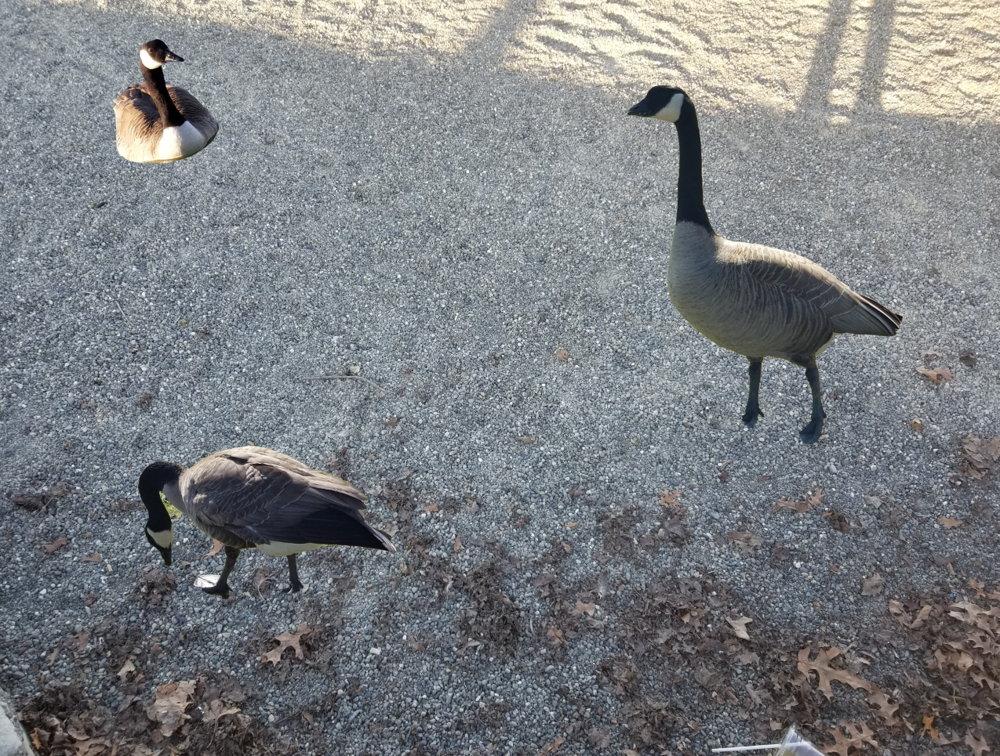


Photoshop tips:

- Object selction
- Photoshop crop to content
- save as a png (for transparent background)
- Open up a background image in photoshop.
- Drag your object in
- Ctr + t free transform
- import multiple backgrounds to make quickly

You may already be asking can I automate this? Well you can automate some of
the generation and part of the labeling with python. Read these here for some ideas! 

[Make synthetic datsets with python](https://www.immersivelimit.com/tutorials/composing-images-with-python-for-synthetic-datasets)

[Pyimagesearch: Face mask detection](https://www.pyimagesearch.com/2020/05/04/covid-19-face-mask-detector-with-opencv-keras-tensorflow-and-deep-learning/)

I also think this could be an awesome feature to add into a tool, like HyperLabel.

### Data Augmentation

You may already be familiar with a more widely used concept of data augmentation.

This allows you to make adjustments to your images when training, like flipping
, skewing, lightness, ect... but it does not create a different environment like
our sythetic data set.

This is usually done while training the model


## Resizing the dataset:

Even though you usually resize in during loading your dataset for training
it can help speed things up resizing your images before loading into memory. 

Resize script:

```python
from PIL import Image
import os
import argparse

def rescale_images(directory, size):
    for img in os.listdir(directory):
        im = Image.open(directory+img)
        im_resized = im.resize(size, Image.ANTIALIAS)
        im_resized.save(directory+img)

if __name__ == '__main__':
    parser = argparse.ArgumentParser(description="Rescale images")
    parser.add_argument('-d', '--directory', type=str, required=True, help='Directory containing the images')
    parser.add_argument('-s', '--size', type=int, nargs=2, required=True, metavar=('width', 'height'), help='Image size')
    args = parser.parse_args()
    rescale_images(args.directory, args.size)
```
[Original script from Gilbert Tanner](https://github.com/TannerGilbert/Tutorials/blob/master/Tensorflow%20Object%20Detection/object_detection_with_own_model.ipynb)

## Labeling the data 

Different type of labels. 

- Image segementation
- Object detection
- Classification

Some other label options you may see in computer vision
- Keypoint
- context

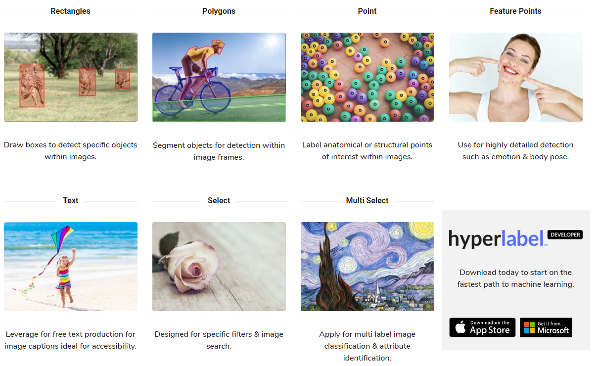


Our case we want to do object detection. The boxes around the objects.

There are a couple good labeling options

- [HyperLabel](https://hyperlabel.com/)
- [labelImg](https://github.com/tzutalin/labelImg)

I chose HyperLabel. Again shout out for them sponsoring tonight!

Enter give away here [https://bit.ly/givinggoose](https://docs.google.com/forms/d/e/1FAIpQLSeyXxjmNCJm0OvjtXMpeADhS0GFanKHPGba0LdWb8JULZq3qQ/viewform?usp=sf_link)


### What labeling looks like

- Open HyperLabel

- Create Project

- Add source
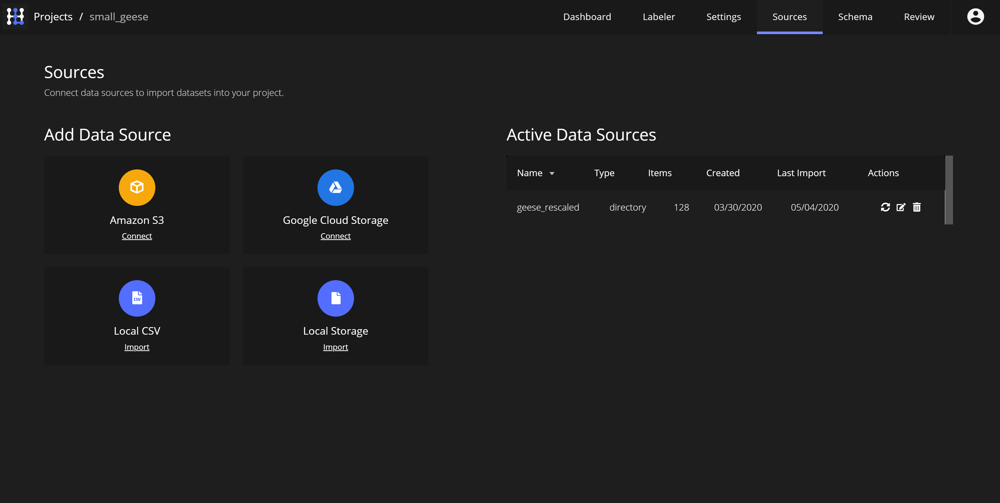

- Create label schema
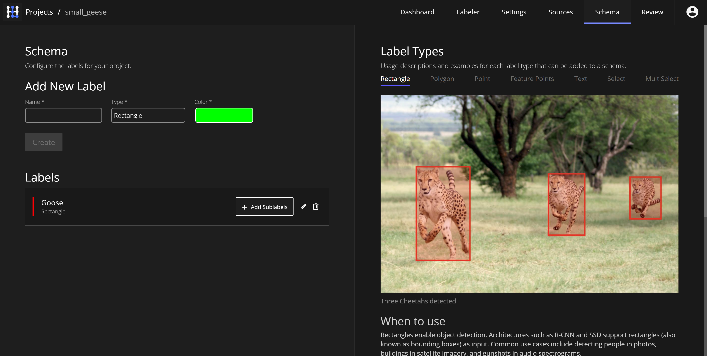

- Label your photos by dragging boxes around them. 
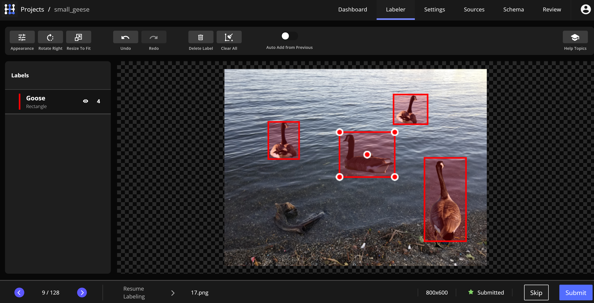

- Export your labels from the dashboard
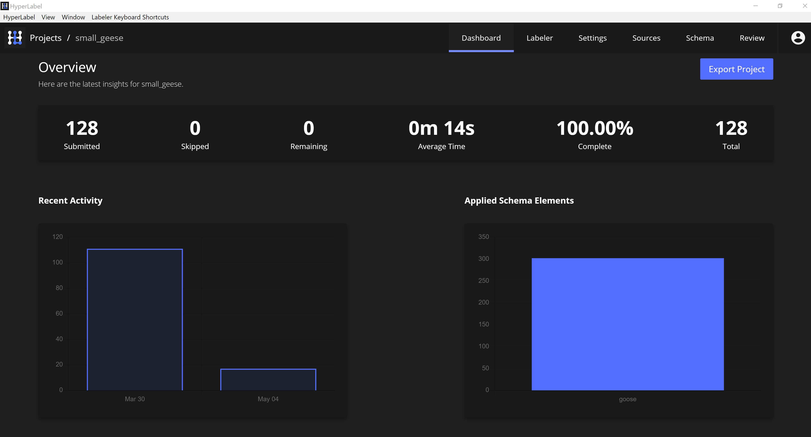

### Exporting

There are several options for exporting. You will need to choose the right one
for your application. 

For me I'm exporting as VOC pascal which exports the images and matching XML 
annotations of boudning boxes for each images.

- goose1.jpg
- goose1.xml

### Understanding the annotations

keep in mind that every labeler may have slightly different annotation generation

XML Example:

```xml
<annotation>
  <folder>GeneratedData_Train</folder>
  <filename>3.png</filename>
  <source>
    <database>3</database>
  </source>
  <size>
    <width>800</width>
    <height>600</height>
    <depth>Unknown</depth>
  </size>
  <segmented>0</segmented>
  <object>
    <name>goose</name>
    <pose>Unknown</pose>
    <truncated>0</truncated>
    <difficult>0</difficult>
    <occluded>0</occluded>
    <bndbox>
      <xmin>159.28430879566355</xmin>
      <xmax>342.9821219169359</xmax>
      <ymin>219.6319686872721</ymin>
      <ymax>405.6469286512451</ymax>
    </bndbox>
  </object>
  <object>
    <name>goose</name>
    <pose>Unknown</pose>
    <truncated>0</truncated>
    <difficult>0</difficult>
    <occluded>0</occluded>
    <bndbox>
      <xmin>537.1769383697813</xmin>
      <xmax>660.7554380746769</xmax>
      <ymin>55.55722749247779</ymin>
      <ymax>179.5672008017932</ymax>
    </bndbox>
  </object>
  <object>
    <name>goose</name>
    <pose>Unknown</pose>
    <truncated>0</truncated>
    <difficult>0</difficult>
    <occluded>0</occluded>
    <bndbox>
      <xmin>84.85088007113569</xmin>
      <xmax>139.24456192532307</xmax>
      <ymin>4.522350222409504</ymin>
      <ymax>82.74403297229314</ymax>
    </bndbox>
  </object>
</annotation>
```

### Converting to a CSV file.

You could skip the step of generating a CSV file and directly create a TF Record
or whatever type of input your model takes, but I've found having a CSV file helpful in the past.

- A chance to pause and check your data
- If your labeling tool doesn't save a project, you can append new annotation
to your CSV file.


```python
def xml_to_csv(path):
    xml_list = []
    for xml_file in glob.glob(path + '/*.xml'):
        tree = ET.parse(xml_file)
        root = tree.getroot()
        for member in root.findall('object'):
            value = (root.find('filename').text,
                     int(root.find('size')[0].text),
                     int(root.find('size')[1].text),
                     member[0].text,
                     int(round(float(member[5][0].text))),
                     int(round(float(member[5][1].text))),
                     int(round(float(member[5][2].text))),
                     int(round(float(member[5][3].text)))
                     )
            xml_list.append(value)
    column_name = ['filename', 'width', 'height', 'class', 'xmin', 'xmax', 'ymin', 'ymax']
    xml_df = pd.DataFrame(xml_list, columns=column_name)
    return xml_df
def main():
    for folder in ['train', 'test']:
        image_path = os.path.join(os.getcwd(), ('images/' + folder))
        xml_df = xml_to_csv(image_path)
        xml_df.to_csv(('images/'+folder+'_labels.csv'), index=None)
    print('Successfully converted xml to csv.')
main()

```
> Original script from Dat Trans [raccoon_dataset](https://github.com/datitran/raccoon_dataset)


### Check your Annotations!

Always check your annotations! I really wish someone had drilled this into me
early. checking you read in your annotations correctly can save you a lot of
time debugging.

Example: Using openCV to read the annotations

```python
# %%
import cv2
import pandas as pd
from PIL import Image

# %%
full_labels = pd.read_csv('train_labels.csv')

# %%
full_labels.head(10)

# %%
def draw_boxes(image_name):
    selected_value = full_labels[full_labels.filename == image_name]
    img = cv2.imread('train/{}'.format(image_name))
    for index, row in selected_value.iterrows():
        img = cv2.rectangle(img, (row['xmin'], row['ymin']), (row['xmax'], row['ymax']), (0, 255, 0), 3)
    return img

# %%
Image.fromarray(draw_boxes('20200320_180628.jpg'))

# %%
Image.fromarray(draw_boxes('20200320_180651.jpg'))
```

> Original script from Dat Trans [raccoon_dataset](https://github.com/datitran/raccoon_dataset)


I'm guilty of not checking and wasting hours debugging. because I was "sure"
I was reading them correctly.

--------------

# Training 

## Model Selection

Different types of computer vision applications require different models

### Common Models for Object Detection

#### Single Shot MultiBox Detector (SSD)

- Object detection
- Fast

[SSD exaplained](https://towardsdatascience.com/understanding-ssd-multibox-real-time-object-detection-in-deep-learning-495ef744fab)

[paper](https://arxiv.org/abs/1512.02325)

#### You Only Look Once (YOLO)

- Object detection
- Fast

[Yolo Explained](https://medium.com/@jonathan_hui/real-time-object-detection-with-yolo-yolov2-28b1b93e2088)

[paper](https://arxiv.org/abs/1506.02640)

#### Mask R-CNN

- Object detection
- Image segmentation
- High accuracy
- Slower

[Mask R-CNN explained](https://medium.com/@jonathan_hui/image-segmentation-with-mask-r-cnn-ebe6d793272)

[Paper](https://arxiv.org/abs/1703.06870)


#### A note on transfer learning

With most popular deep learning frameworks you can load pre-trained weights into
your network. These have been trained extensivly on quite a few objects and animals.

You can then adjust those weights during training to work for you specific data set.

Think of it as not starting from zero.

- [Imagenet dataset](http://www.image-net.org/)
- [Coco dataset](http://cocodataset.org/#home)


A good rule of thumb is to start with a minimum 200 images transfer learning.
But this can vary a lot depending on your data and the results you want. 

Our goose dataset has less than 200 images, but over 200 instances of a goose.

without transfer learning you will probably need thousands of images and a lot more time. Keep in mind that synthetic data may be a way to turn hundreds into thousands. Depends on you data and what
you're doing with it. 

[Transfer Learning Explained](https://towardsdatascience.com/a-comprehensive-hands-on-guide-to-transfer-learning-with-real-world-applications-in-deep-learning-212bf3b2f27a)

#### Implementations

There are quite a few implementations for different model types and our datase
should work with all of them. 

I chose to use ones included in [tensorflows offcial repo](https://github.com/tensorflow/models/tree/master/research/object_detection).

Note that most of the models are under the research directory. These are not
always offcially maintained. 

There is a great resource to get started with the included tensflow model here:
- [Tensorflow object detection setup guide](https://gilberttanner.com/blog/creating-your-own-objectdetector)
- [Tensorflow Model Zoo](https://github.com/tensorflow/models/blob/master/research/object_detection/g3doc/detection_model_zoo.md)

Quick tip on setting up setting up:

- Python 3.6
- Tensorflow 1.15
- Numpy 1.17

More resources included at the end.

Any implementation you use will need to read in the iamges and annotations.
So keep it in mind that you'll want to check you're reading them correctly.

Create TF record with our CSV file containing images and annotations:

```python

def create_tf_example(group, path):
    with tf.gfile.GFile(os.path.join(path, '{}'.format(group.filename)), 'rb') as fid:
        encoded_jpg = fid.read()
    encoded_jpg_io = io.BytesIO(encoded_jpg)
    image = Image.open(encoded_jpg_io)
    width, height = image.size

    filename = group.filename.encode('utf8')
    image_format = b'jpg'
    xmins = []
    xmaxs = []
    ymins = []
    ymaxs = []
    classes_text = []
    classes = []

    for index, row in group.object.iterrows():
        xmins.append(row['xmin'] / width)
        xmaxs.append(row['xmax'] / width)
        ymins.append(row['ymin'] / height)
        ymaxs.append(row['ymax'] / height)
        classes_text.append(row['class'].encode('utf8'))
        classes.append(class_text_to_int(row['class']))

    tf_example = tf.train.Example(features=tf.train.Features(feature={
        'image/height': dataset_util.int64_feature(height),
        'image/width': dataset_util.int64_feature(width),
        'image/filename': dataset_util.bytes_feature(filename),
        'image/source_id': dataset_util.bytes_feature(filename),
        'image/encoded': dataset_util.bytes_feature(encoded_jpg),
        'image/format': dataset_util.bytes_feature(image_format),
        'image/object/bbox/xmin': dataset_util.float_list_feature(xmins),
        'image/object/bbox/xmax': dataset_util.float_list_feature(xmaxs),
        'image/object/bbox/ymin': dataset_util.float_list_feature(ymins),
        'image/object/bbox/ymax': dataset_util.float_list_feature(ymaxs),
        'image/object/class/text': dataset_util.bytes_list_feature(classes_text),
        'image/object/class/label': dataset_util.int64_list_feature(classes),
    }))
    return tf_example

```
> Original script from Dat Trans [raccoon_dataset](https://github.com/datitran/raccoon_dataset)


## Training the model

I trained my model with the default settings in tensflow for about and hour and a half.
In my case that was 38k epochs. Our data set is small so each epoch is not long. 

--------------

# Results

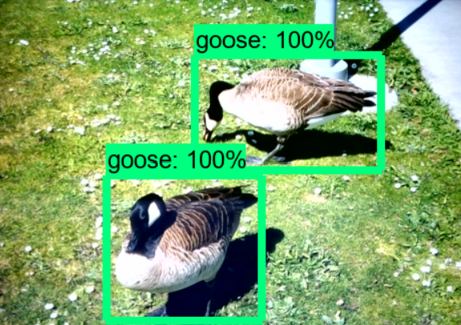


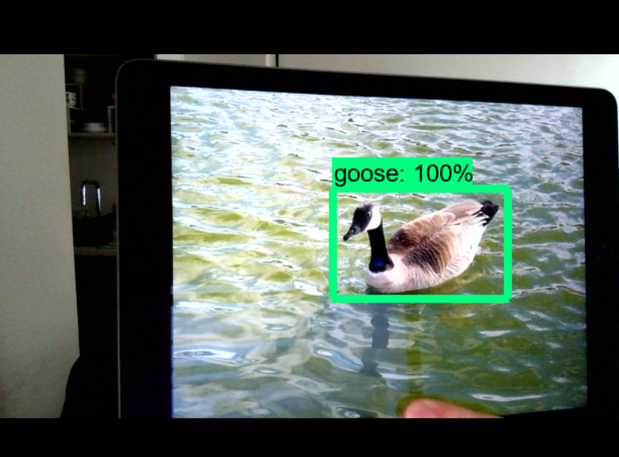


## What happens if we were to change environments?

Let's say now our goal is to detect geese in my apartment

> It's very sure I'm a goose!


> It's pretty sure I'm a goose!


> me and the chair are geese


Using transfer learning even with out small dataset we did a pretty good job of
telling our model what a goose **IS**.

But we didn't do a good job of telling it what a goose **ISN"T**.


## Synthtic dataset #2 Feat: living room

We want to add in some noise to the data, like objects and people so as the
model is training it can learn when it makes a mistake on them.


## Create data set with living room:

> Geese in my living room!


> Very disruptive to my work
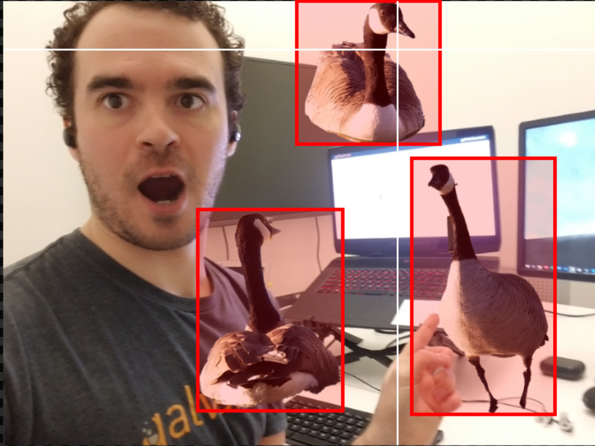

> I'm over it
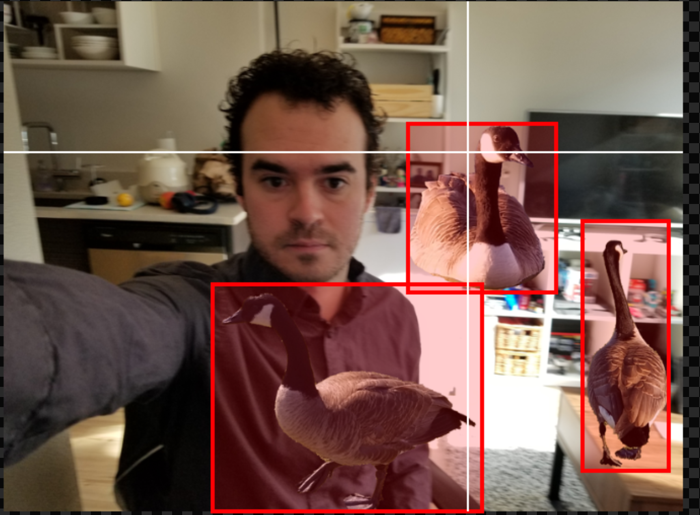

> They even followed me on vacation....


> Geese invade Galvanize rooftop!
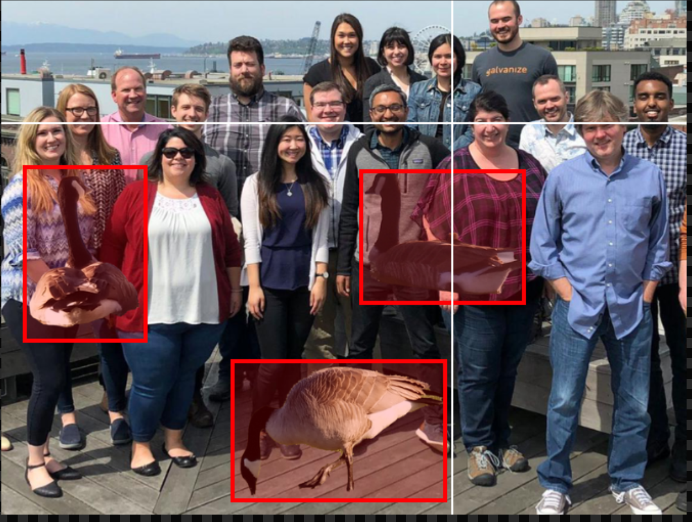

> Image from unsplash (if you don't have images yourself you may be able to find the on the web)
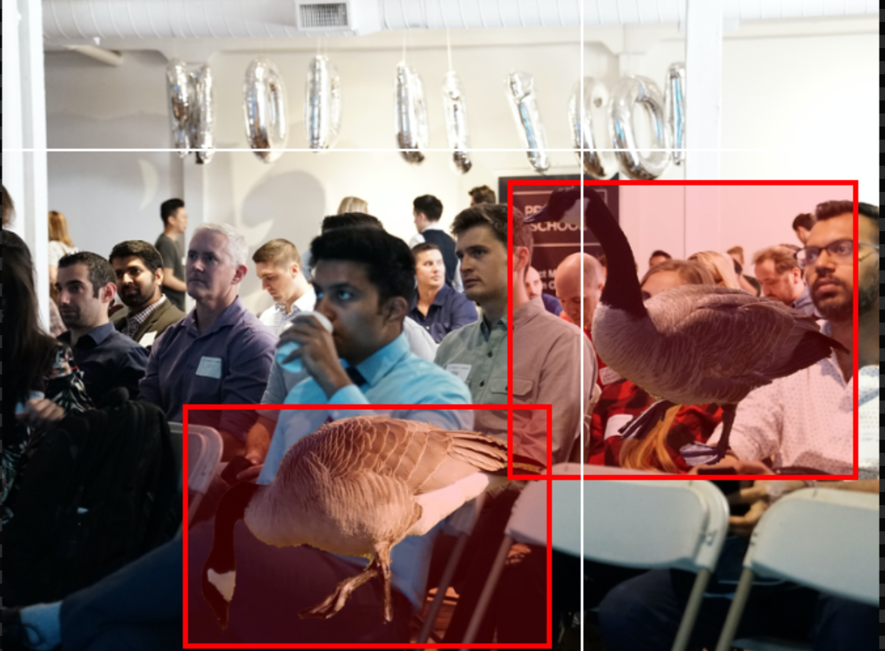

In total I added just 10 new images with my living room or people in the background

Sync HyperLabel project with new data

Lets re-train our model and see the results

## Results #2:

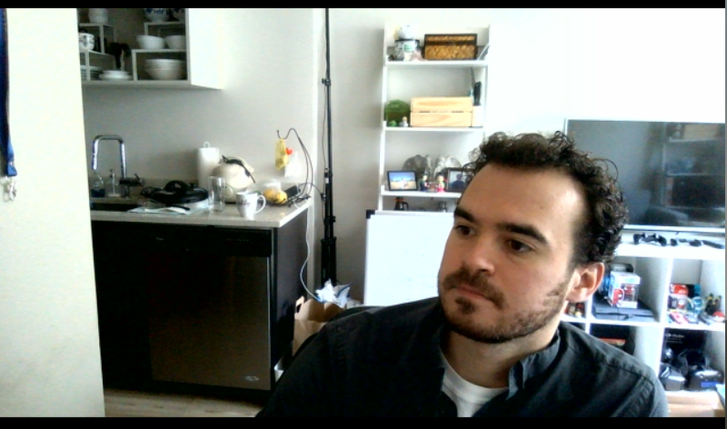


It's not perfect


We could fix by adjusting the confidence 


## Future improvements:

- More data
- More synthetic data. chairs...
- Data with Shadows
- Train longer. In my case the output was still showing improvments
- More data augmentation

--------------

# Wrap up


## Summary

I hope this inspired you to make your own object detector or get started with computer vision in general! I think it's one of the coolest fields! 

And even though we only scratced the surface I hope you got an idea of how powerful sythetic data sets have the potential to be! And you can start experimenting with them right now!


## HyperLabel Give away

Again, thank you to HyperLabel and Alex for sponsoring and hanging out tonight.

Enter here for a chance win a $75 doordash gift card to help support a local restaurant: [https://bit.ly/givinggoose](https://docs.google.com/forms/d/e/1FAIpQLSeyXxjmNCJm0OvjtXMpeADhS0GFanKHPGba0LdWb8JULZq3qQ/viewform?usp=sf_link)


## Useful Resources:

- [HyperLabel: Image labeling](https://hyperlabel.com/) used for labeling the images

- [Tensorflow object detection setup guide](https://gilberttanner.com/blog/creating-your-own-objectdetector)

- [Make a mask detector using sythetic data](https://www.pyimagesearch.com/2020/05/04/covid-19-face-mask-detector-with-opencv-keras-tensorflow-and-deep-learning/)

- [Make synthetic datsets with python](https://www.immersivelimit.com/tutorials/composing-images-with-python-for-synthetic-datasets)

- [Racoon detection blog post](https://github.com/datitran/raccoon_dataset)

- [Google Colab](https://colab.research.google.com/notebooks/intro.ipynb): online code editor with free GPU & TPU access.

- [Machine Learning Mastery](https://machinelearningmastery.com/)

- [Pyimageseach](https://www.pyimagesearch.com/)

- [Tensorflow Model Zoo](https://github.com/tensorflow/models/blob/master/research/object_detection/g3doc/detection_model_zoo.md)

## Upcoming events:

- [Deep Learning Design Patterns Study Jams - Overview](https://www.meetup.com/gdg-seattle/events/270036681/) 5/7(TODAY) 7:00pm PDT

- [Intro to Machine Learning workshop](https://www.eventbrite.com/e/intro-to-machine-learning-tickets-103360447882) Tue 5/12 5:30pm PDT

## Thank you for coming!

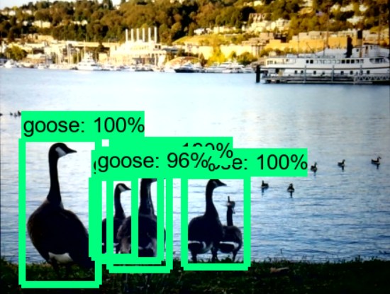

## Stay connected:

Please feel free to reach out to me with any questions. 
I love helping other learn.

- this github repo: [goose.sage.codes](https://github.com/sagecodes/make-a-wildlife-object-detector)
- linkedin: [Sage Elliott](https://www.linkedin.com/in/sageelliott/)
- twitter: [@sagecodes](https://twitter.com/sagecodes)
- site: [sageelliott.com](https://sageelliott.com/)
